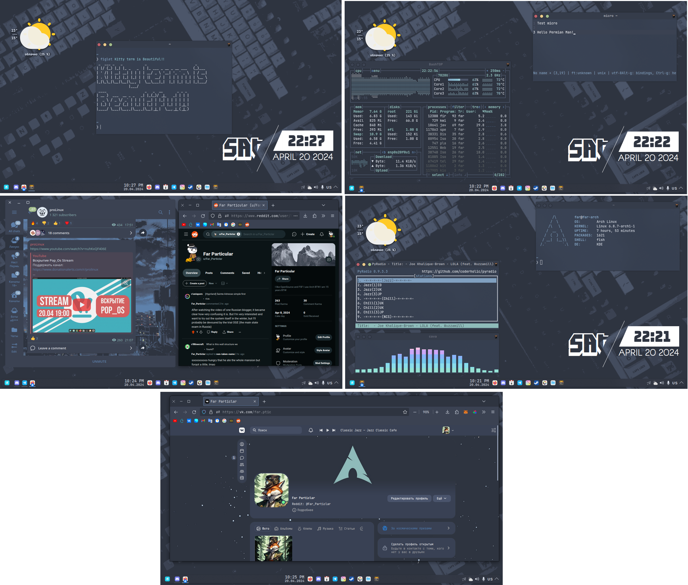

# Dot Files Nord Theme
> My dotfiles with Nord can be used for customization in the same palette.

> ProLinux IS TOP

# I added
* Fonts: JetBrains Mono 10PT
* Plasma theme: Nordic Bluish
* SDDM: Nordic Bluish(Customized Main.qml, deleted Battery())
* Icons: Colloid Nord Dark
* Pyradio: base16-nord
* Micro: nord-tc
* Kitty: Nord theme
* TG: Nord
* Bashtop: Nord(taken is Fossies)
* Cava: SpyderGamer theme(a little bit differently)
* sl: none
* VK: VK Styles(Ссылка в текст файле)
* MonkeyType: Nord theme, JetBrains Mono 10pt
* Widgets: Vector clock, Simple weather
* Wallpapers: linuxdotexe/nordic-wallpapers

# Color Pallete

  <picture>
    
  </picture>

  
# Enjoy

